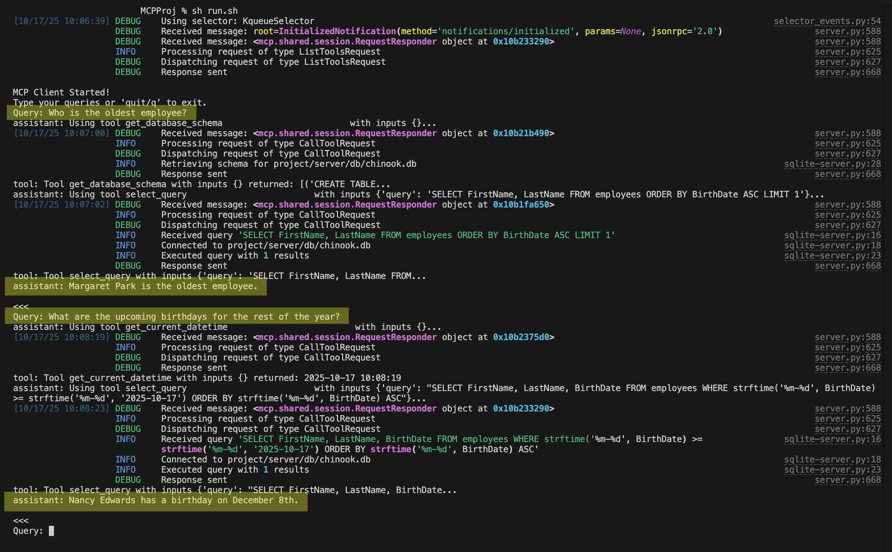

# sqlite-mcp-cli-chat

[](https://opensource.org/licenses/MIT)


A simple cli mcp client-server chat application that lets you talk to a single sqlite database and related files.

Run with:
```
sh run.sh
```

Output:

